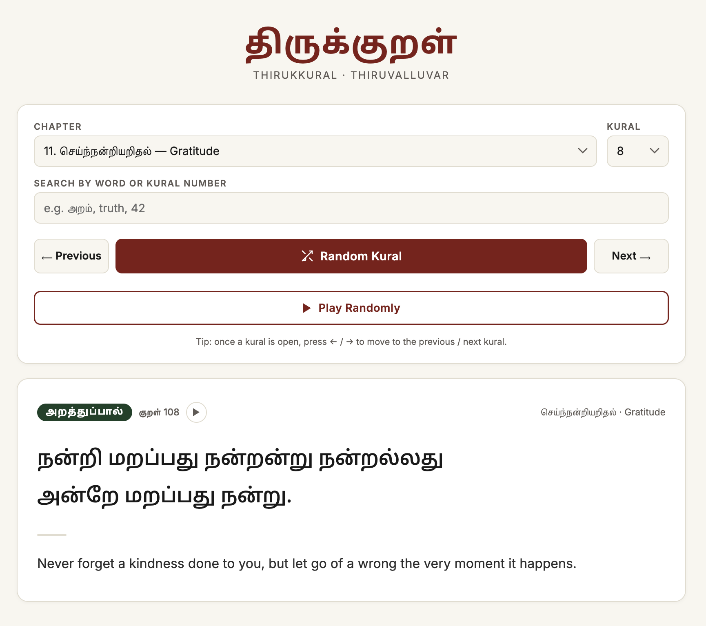

# திருக்குறள் · Thirukkural

A minimal, accessible web reader for the **Thirukkural** — 1,080 couplets composed by the Tamil poet-philosopher **Thiruvalluvar**, covering ethics (*Arathuppal*) and wealth and governance (*Porrutpal*). The third book, *Kamattupal* (love), has not been added yet.

## Live App

**[https://subashini7.github.io/kural/](https://subashini7.github.io/kural/?kural=1)**



## Features

- Browse all chapters and kurals with Tamil and English side by side
- Keyboard navigation (← / → arrow keys)
- Random kural button
- Search by Tamil word, English phrase, or kural number
- Deep-linkable URLs (`?kural=610`)
- Per-kural audio playback (Tamil + English, read aloud)
- **Play Randomly** — shuffles all available kurals and plays them in a fresh random order each time
- **Share button** — copies the deep-link URL to clipboard (or opens the native share sheet on mobile)
- **Reactions** — thumbs up / down per kural; vote persists in `localStorage`, toggle to unvote or switch direction
- **Anonymous comments** — per-kural comment thread stored in Supabase; no login required
- **Dark mode** — toggle in the header; respects `prefers-color-scheme` on first visit, persists in `localStorage`
- **Resizable text** — A− / A+ buttons scale the Tamil and English text across three sizes
- Fully accessible (ARIA live regions, skip link, focus management)

## Translation Philosophy

The English translations in this project are not a word-for-word rendering of any classical edition. They were written from the Tamil source with four guiding principles:

### 1. Accuracy
Every translation is cross-checked against the Tamil text to ensure the core meaning, imagery, and logical structure of each kural is preserved. Where classical English translations introduced errors — reversals of meaning, omitted key Tamil words, or invented concepts not present in the original — those have been corrected.

### 2. Inclusivity
Traditional translations sometimes used disability as a metaphor for moral failure (e.g. "eyes that cannot see" to mean "useless"). This edition replaces such language with functional, non-hurtful alternatives that preserve the poetic intent without treating any physical difference as a stand-in for inadequacy.

### 3. Gender Neutrality
Thiruvalluvar's philosophy is universal. Where the Tamil uses male-specific terms as a grammatical convention (a common feature of classical Tamil), this edition uses gender-neutral language — "they/them/a person" rather than "he/him" — so the wisdom speaks to every reader equally.

### 4. Layman Simplicity for a Global Audience
The translations are written to read naturally to a contemporary global audience in 2026. Corporate jargon, academic abstractions, and archaic diction have all been removed. The goal is for each kural to land with the same directness and wit it carries in Tamil — no footnotes required.

## Audio

Audio files are generated using **Azure Cognitive Services Text-to-Speech**:

- **Tamil**: `ta-IN-ValluvarNeural` (male) at −25% speed
- **English**: `en-GB-SoniaNeural` (female) at −25% speed
- Format: 24 kHz mono MP3

Audio is available for all **1,050 kurals** (1–1,080, excluding the three chapters under review). The script to regenerate audio is in `scripts/generate-audio.js` and requires an `.env` file with `AZURE_TTS_KEY` and `AZURE_TTS_REGION`.

- **Pronunciation fixes**: The script applies SSML phoneme tags for English heteronyms that Azure mispronounces (e.g. *wound* as an injury is forced to "wuːnd"; *the letter A* uses `<say-as interpret-as="characters">` to avoid being read as the article). Em-dashes in English translations mark the Tamil couplet's line-break pivot so Azure's prosody model pauses in the right place.

## Sources

### Tamil text

The Tamil couplets are sourced from [tk120404/thirukkural](https://github.com/tk120404/thirukkural), a structured dataset of all 1,080 kurals with chapter and section metadata.

### English translation

Original modernised rendering written for this project, cross-checked against the Tamil source and reviewed for accuracy, inclusivity, gender neutrality, and plain-language clarity.

## Tests

The test suite uses Node's built-in `node:test` runner — no dependencies to install.

```bash
npm test
```

| File | What it covers |
|---|---|
| `tests/data.test.js` | `kurals.json` integrity — required fields, no duplicates, `tamil` matches `line1 + line2`, removed chapters absent, `meta.total_kurals` accurate, no invalid Tamil Unicode codepoints, 4+3 word structure per couplet |
| `tests/ssml.test.js` | `escapeXml`, `addEmphasis`, and `buildSsml` — XML escaping, emphasis tagging, SSML structure |

## Project Structure

```
kural/
├── index.html              # Single-file web app (no build step)
├── sitemap.xml             # XML sitemap for search engine indexing
├── robots.txt              # Allows all crawlers and points to sitemap
├── data/
│   ├── kurals.json         # Active kurals with Tamil, English, chapter, and section fields
│   └── chapters_under_review.json  # Chapters temporarily removed pending translation review
├── audio/
│   └── {number}.mp3        # Pre-generated TTS audio for all kurals (excl. chapters under review)
├── screenshots/
│   └── kural-ex.png        # App screenshot used in README and Open Graph tags
├── scripts/
│   └── generate-audio.js   # Azure TTS generation script (requires .env)
└── tests/
    ├── data.test.js        # Data integrity tests
    └── ssml.test.js        # SSML helper unit tests
```

## Coverage

| Section | Chapters | Kurals | Status |
|---|---|---|---|
| அறத்துப்பால் (Arathuppal — Virtue) | 1–38 | 1–380 | Included |
| பொருட்பால் (Porrutpal — Wealth) | 39–108 | 381–1080 | Included |
| காமத்துப்பால் (Kamattupal — Love) | 109–133 | 1081–1330 | Not yet added |

> **Note:** Three chapters (6, 15, 92) are currently in `data/chapters_under_review.json` and not displayed in the app. They are being reviewed for gendered framing before being reintroduced with updated translations.

Audio playback is available for all 1,050 kurals (1–1,080, skipping the three chapters under review).
